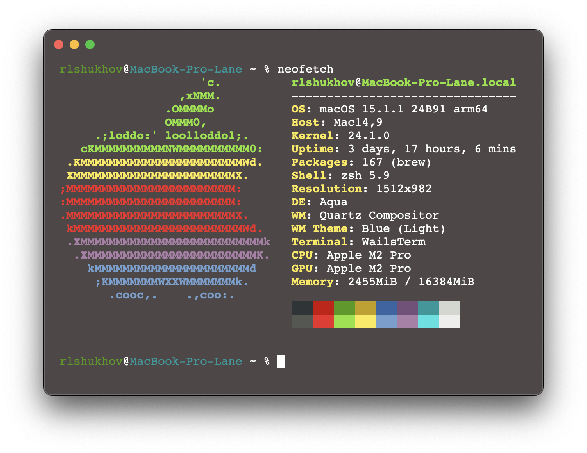

# WailsTerm

Simple translucent terminal app build with **Golang** + **WebKit** + **Vanilla JS** + **Websockets** and powered by **[Wails 2](https://wails.io)** + **[Xterm.js](https://xtermjs.org)**



## Features

- [x] Basic terminal app functionality

TODO:

- Test on Windows/Linux OS
- Configure Unix shell (now supports only zsh)
- Setup CI/CD and releases
- Tabs support
- Multiple window support
- Split window support
- Maybe, [Hyper.js](https://hyper.is) compatibility?
- Plugin system

## Supported OS

- [x] MacOS (tested on macOS 15.1.1)
- [ ] Windows (not tested, but supported by stack)
- [ ] Linux (not tested, but supported by stack)

## Build

```shell
wails build -clean
```
*or*
```shell
wails dev
```
