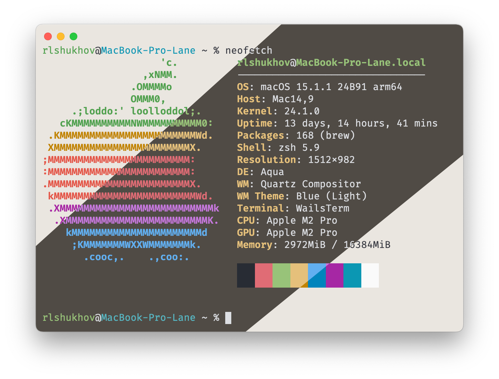

# WailsTerm

Simple translucent terminal app build with **Golang** + **WebKit** + **Vanilla JS** + **Websockets** and powered by **[Wails 2](https://wails.io)** + **[Xterm.js](https://xtermjs.org)**



## Features

- [x] Basic terminal app functionality
- [x] Translucent
- [x] Auto light/dark theme support
- [x] Configurable
- [x] WebLinks support (open with `cmd+click` on macOS, and `ctrl+click` on Windows/Linux)

### TODO:

- Test on Windows/Linux OS
- Setup CI/CD and releases
- Tabs support
- ~~Multiple window support~~ (at now, can run multiple app instances with one window per instance)
- Split window support
- Maybe, [Hyper.js](https://hyper.is) compatibility?
- Plugin system

## Configuration

Config is located at `~/.config/wailsterm/config.yaml` for Linux/macOS, and `%AppData%/wailsterm/config.yaml` for Windows.

Config is created and fill with default values at first launch.

This is default config example:
```yaml
version: 1
application:
    single_instance: true # if set to `true`, only one instance of app can run at time
shell:
    path: /usr/bin/env
    args:
        - /bin/zsh
        - --login
    envs:
        - name: TERM
          value: xterm-256color
        - name: LC_CTYPE
          value: UTF-8
window:
    theme: auto # auto | light | dark
    size:
        width: 600
        height: 400
terminal:
    theme: OneHalf # OneHalf
    font:
        family: FiraCode # FiraCode
        size: 15
        weight: 400
        weight_bold: 600
```

## Supported OS

- [x] MacOS (tested on macOS 15.1.1)
- [ ] Windows (not tested, but supported by stack)
- [ ] Linux (not tested, but supported by stack)

## Build

```shell
wails build -clean
```
*or*
```shell
wails dev
```

## License

This project licensed under Mozilla Public License Version 2.0, full version on license you can view at [LICENSE](LICENSE)
